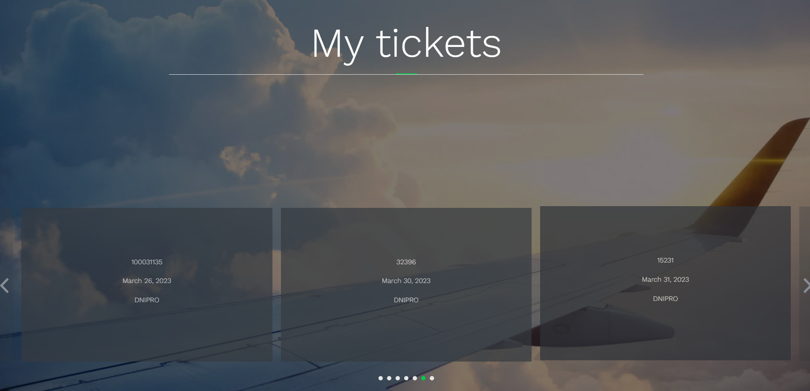

# Travel Manager Project
Django project for managing your travel plans
## Check it out
[Travel Manager  deployed to Render](https://travel-manager.onrender.com/)
```text
YOU CAN USE THIS CREDENTIALS TO LOGIN OR REGISTER NEW USER
username: trav3l
password: 2wsxvfr4
```
## Installation
Python3 must be already installed
```shell
git clone https://github.com/yura-hudzovskyi/travel-manager.git
cd travel-manager
python -m venv venv
source venv/bin/activate (on Linux/maOS)
venv\Scripts\activate (on Windows)
pip install -r requirements.txt
python manage.py migrate
export SECRET_KEY="<your_secret_key>"
python manage.py runserver
```
You can generate your secret key in [Djecrety](https://djecrety.ir/)
## Features
* Authentication/Registration functionality
* Manage your tickets(create, delete)
* Add new routes, trips and hotels in admin panel
* Edit your profile(also can change your password)

## Demo



